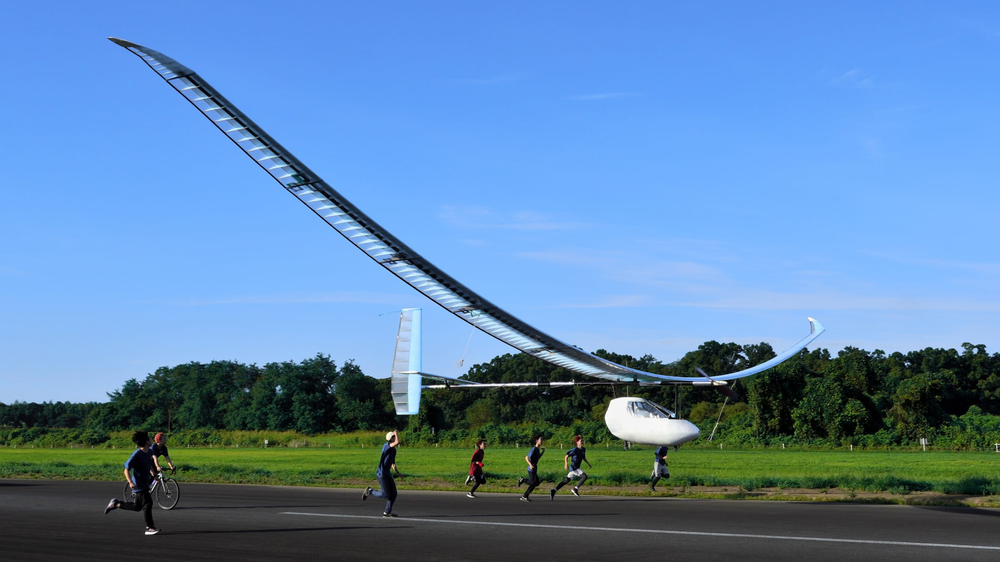

## About me

Hello — I'm Keitaro Ueki.

I spent a while wondering what the first post here should be, and decided to start with an
introduction.

- Third-year undergraduate, Department of Communications and Computer Engineering, Waseda University
- AI engineer (intern)
- Former birdman

If the third line raised an eyebrow, let me start there.

## The Birdman Rally

The Japan International Birdman Rally is a competition where teams build their own human-powered
aircraft and fly them as far as they can over Lake Biwa. It is held every summer and broadcast as a
television special by Yomiuri TV.

I was a member of WASA, Waseda University's human-powered aircraft club. It has been running for
over forty years, and every year the team designs an aircraft from scratch, builds it, and hauls it
to Lake Biwa.

My own work was not on the aircraft itself: I handled operations, sponsor relations, and outreach.
Correspondence with sponsors and the competition office, the paperwork, and the records and posts
that told people outside the club what we were doing. The pilot and the design team are the ones who
get the aircraft off the ground, but getting them that far takes people who raise the money, hold
the deadlines, and act as the point of contact with the outside world. That was my side of it.

What stayed with me is the sense that **engineering alone doesn't fly**. However good the design is,
the aircraft never takes shape if the materials don't arrive; and if nobody outside can tell what
you are doing, neither the funding nor the next generation of members arrives either. Building
something and keeping it buildable are two different jobs.

## As an AI engineer

These days I intern at [neoAI](https://neoai.jp/), building products with machine learning and large
language models. In the summer of 2026 I also joined the jig.jp summer internship, where our team
took an app for a pair of smart glasses from concept to implementation.

Most of my own time goes to [WASA Chat](/en/projects/wasa-chat), a chatbot that answers
natural-language questions across the handover wiki and public documents of the same WASA I just
described.

What makes it interesting is that the hard part is not producing clever answers — it's not producing
wrong ones. People read the handover documents and then build an aircraft based on what they read, so
a plausible-sounding fabrication is the worst possible failure. That's why every answer carries its
sources and links back to the original document.

The other one is [HRS](/en/projects/hrs), a hotel reservation system from my software engineering
course. It was my first proper experience of doing UML analysis and design first and implementing
afterwards. Implementing exactly what the design says turned out to be harder than expected, and I
redrew the line between "decided in the diagram" and "decided in the code" several times.

## What I'll write here

Roughly three things:

1. **Records of what I build** — less about what I made, more about why it is designed that way. The
   reasoning is what I forget first.
2. **Notes on what I learn** — a place to rewrite what I understood from a lecture or a paper in my
   own words.
3. **Things that didn't work** — failed implementations and options I decided against. That kind of
   write-up is hard to find by searching, which is exactly why it seems worth writing.

I haven't settled on a schedule, but I'll write when I have something to say.

## Contact

My work and code live on [GitHub](https://github.com/97kuek). Feel free to reach out there.
