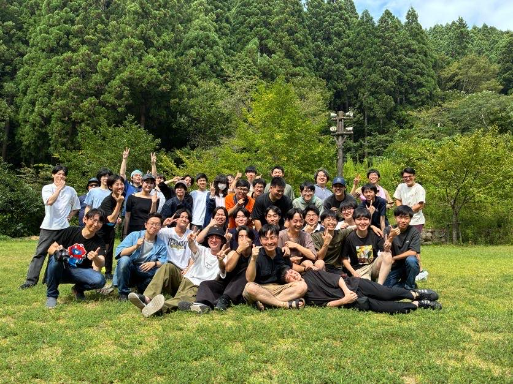
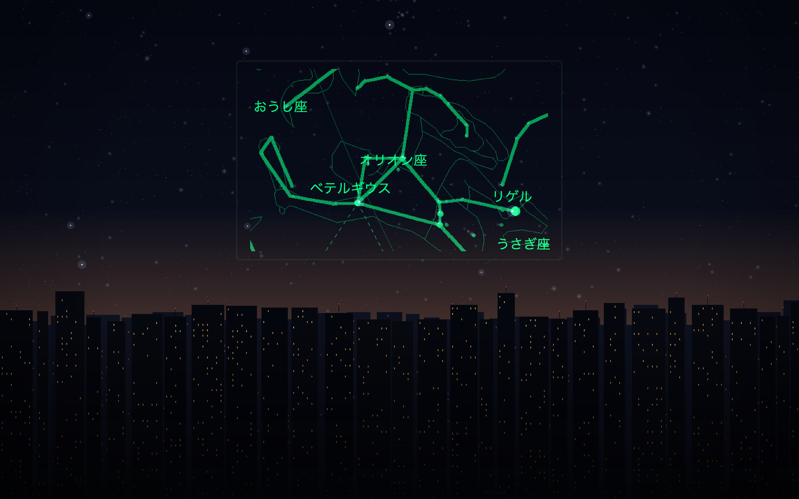
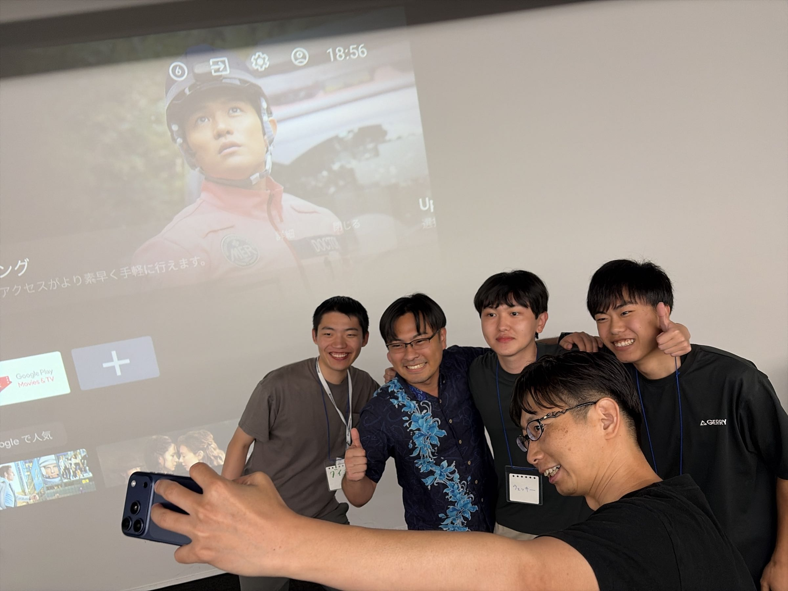
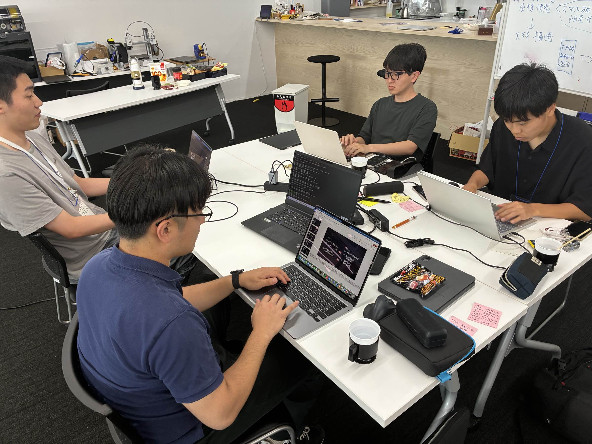
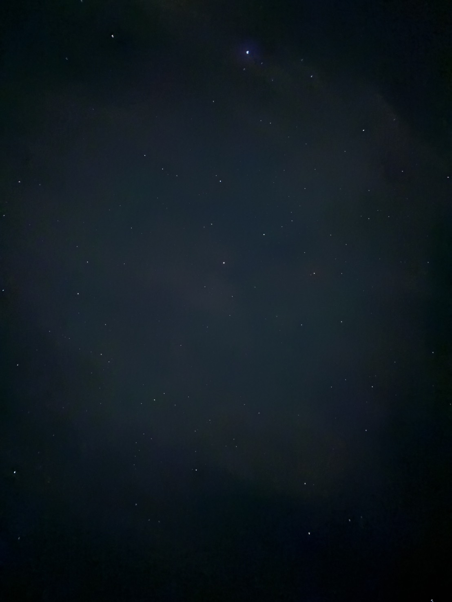

## Introduction

From 17 to 28 August I took part in the jig.jp summer internship.

The programme puts you in a traditional farmhouse in Fukui for two weeks, where your team builds an
app for a pair of smart glasses called SABERA.

This is what I took away from those two weeks of living and building together.



## Why I applied

I first heard of jig.jp at the information session for this internship.

What they described there was a brand-new internship built around SABERA, one of the first smart
glasses developed in Japan — and we would be its first cohort.

There aren't many chances to be around a device category as it is being stood up, one that is
neither a phone nor a PC. That, plus a plain curiosity about wearing smart glasses, was enough to
make me apply.

## What we built

The SABERA course splits everyone into three teams of three. Ours built an app called **Hoshishirube
(星導)** — roughly, "star guide."

Put SABERA on, look up, and the constellations are drawn over the sky you are actually looking at.
It guides you through the night sky, hands free.



## How it went

At the final presentations on the last day, we were given the Audience Award.



The prize was meant to be a year of Claude Code, but on a suggestion from Taisuke Fukuno, the
founder of jig.jp, one of the three of us would instead receive an actual SABERA unit.

I had not expected to walk away with real hardware, so this was genuinely exciting. The catch: one
unit, three people. We settled it with a single round of rock-paper-scissors, with a SABERA (worth
around 100,000 yen) on the line.

I won. Ito, Neru — next time we meet, let's take turns with it.

Getting the hardware was great, but what I was actually proud of was winning it with these two.

Ito built the slides, fixed a countless number of bugs, and kept the ideas coming. Neru never
stopped asking "wouldn't this be better?" about the UI and UX. And Daisu built out the SDK at
absurd speed so that we could turn our ideas into something real. Thank you, all of you.

## Asking what only SABERA can do

We spent far more of the build period than I expected on ideation and on arguing about what SABERA
is actually good for. Thanks to Ito, Neru, Nanigashi, and Mepu for sitting through those
conversations.

SABERA's strengths are that information is there without reaching for your phone, and the experience
of an AR HUD. But if you stop at "it's convenient," the honest answer is that a phone would do.

So: **what is it that only SABERA can do?** That was the question I kept circling.

The first ideas on the table were running a Claude Code or Codex terminal on SABERA, and showing a
TODO list. A coding agent running on smart glasses would, frankly, be very cool. But competitors
like the Even G2 already do this, so it wasn't something SABERA alone could do.

We dropped it not because it was technically out of reach — the opposite. With AI you can build
almost anything now, which means **that idea can be built at any time**; it didn't need to be the
thing we built in these two weeks. That was the moment my criterion shifted from "can this be
implemented" to "is there a reason to do it here."

The direction came from a teammate saying, "I want to do something with the 6-axis IMU." The instant
I heard it, a constellation app surfaced in my head. On a device where the direction your head is
facing is the input, the act of looking up can be the interface itself. And the night sky only
exists up there in the first place.

It surprised me how differently the other teams read SABERA's strengths. One team valued the fact
that nobody else can see your screen, which — fair enough, they had a point.

## Changing course at the midpoint review

Thanks to my teammates, we had a working prototype exactly one week in.

Then came the midpoint review, where advice from the CFO turned the team's direction around.

Two points, mainly:

- There is more business demand for this than you'd think
- Your target user isn't narrow enough

I had quietly suspected the second one myself, so hearing it out loud was more "yeah, thought so"
than a surprise. I'm glad it came at that stage.

We shifted from there, adding a way to author stargazing guides for travel companies and a way to
distribute them.

What landed best in the end, it turned out, was that we had designed the app to use as little
network as possible.

The places you actually watch the sky from — mountains, campsites — usually have no signal. We had
built on the assumption that an app that doesn't work there is worthless, and that assumption became
the strength. Starting from a constraint mattered more than I expected.

## Notes on AI-driven development

We leaned heavily on Claude Code and Codex. A few things I noticed.

### Building an MVP first brings the ideas out

Once something works, options you couldn't see while it was all in your head suddenly become
visible. I felt this strongly.

### Humans are still better at the first round of ideas

Choosing the technical architecture also kept needing someone with the fundamentals to make the
call. Precisely because AI has comprehensively overtaken us at writing the code, the knowledge
around the code is what earns its keep.



### Scale becomes the bottleneck, all at once

The early speed is genuinely fast, but as the code grows you start hitting walls. So we kept the
documentation in order to the very end.

One thing that worked well was numbering the documents in reading order:

```
10_xxx.md   ← SDK
11_xxx.md
20_xxx.md   ← calculations
21_xxx.md
index.md
```

The 10s are SDK-related, the 20s are calculation-related, and so on. Adding an `index.md` on top of
that let the AI make progress without burning context on the wrong files. Recommended.

### It's easy to end up asking "did we need that?"

Because features come out so fast, things built on momentum turn into "do we actually want this?"
later. Shipping lots of features feels like progress, and that feeling is exactly what ends up
hurting the UX.

### Where to draw the line with AI

Two weeks in, I have a rough line of my own.

What we should do ourselves is framing the problem at the start and getting the team to a shared
understanding. Handing that to an AI while it's still vague about what we want to build only gets
you something equally vague back.

On top of that, what mattered was being able to hold a conversation **one level up — about the
database, the API, the SDK — even without writing the details of the code**. The resolution you have
at that layer is what ends up being the quality of the result.

Have it write code once there is a plan. Reverse that order and you generally pay for it in rework.

## What didn't go well

### We divided the work too loosely

There were stretches where who was doing what stayed vague. Straightforwardly, that's on us.

### We weren't aligned on the one thing we most wanted to say

Going into the final talk, I had the feeling each of us was holding a slightly different favourite
point. Misalignment is frightening.

### My talk was too much like a conference presentation

The final talk was not, I think, in good form for a lightning talk. It followed academic conference
conventions to the letter.

To put it kindly, I had prepared plenty of appendix slides and thought about the breadth and depth
of the questions I might get. But an LT is not that kind of venue.

Next time I want to speak with the tension out of my shoulders, the way Yadon does. How do you
produce that kind of ease?

## Life in the farmhouse

Two weeks of living with people I had never met. On the shinkansen down I kept wondering how it
would go. Most of the others were KOSEN students — Japan's technical colleges, where people start
engineering at fifteen — and I wasn't sure a university student would keep up with the conversation.

It was, to put it plainly, entirely unfounded worry.

Everyone was ambitious and serious about what they were doing, and I was struck by how many
different kinds of strength were in the room:

- people who ship
- people with depth in a technology
- people who are good at putting things into words
- people who are good at thinking out loud with an AI
- people who are good at choosing an idea and a motif

I was on the shipping side of that list, and correspondingly hopeless at putting things into words.

I felt it most when explaining an idea in my head to a teammate. The concept is clear to me, and I
still can't hand it over intact. I say things the moment I think them, so I never assembled the
structure in my head before speaking.

Ideally I'd like to speak the way you write markdown headings. If I could assemble something at the
granularity of "## here's what I want to talk about" and "### three reasons" before opening my
mouth, how much lands would change considerably. Homework for next time.

Fortunately we had someone on the team who is good with words, and thanks to them the ideas in my
head did take shape. Thank you, sincerely.

### The farmhouse is almost too good for debugging Hoshishirube

Also: it is extremely dark around that farmhouse.

Which made it an unbeatable place to debug Hoshishirube. Step outside and you're in the test
environment — a luxurious situation. It doubled as a decent digital detox.



## What's next

I had done team projects in university courses, but never with people I had never met.

Learning that there are so many different values and strengths out there was the biggest thing I
took from it. From here I want to show up at more hackathons and meetups, and widen what I'm good
at.

Starting with building something on the SABERA I now own.

Thank you for two excellent weeks.
