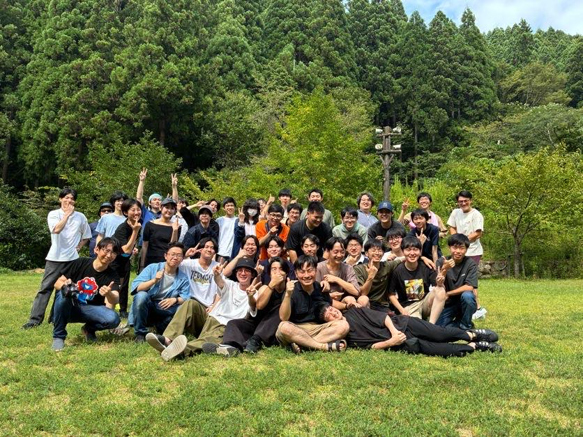
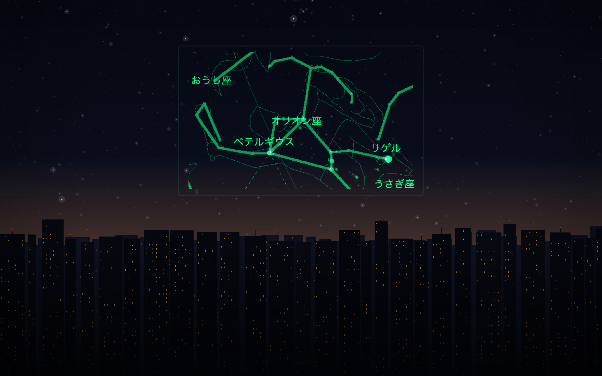
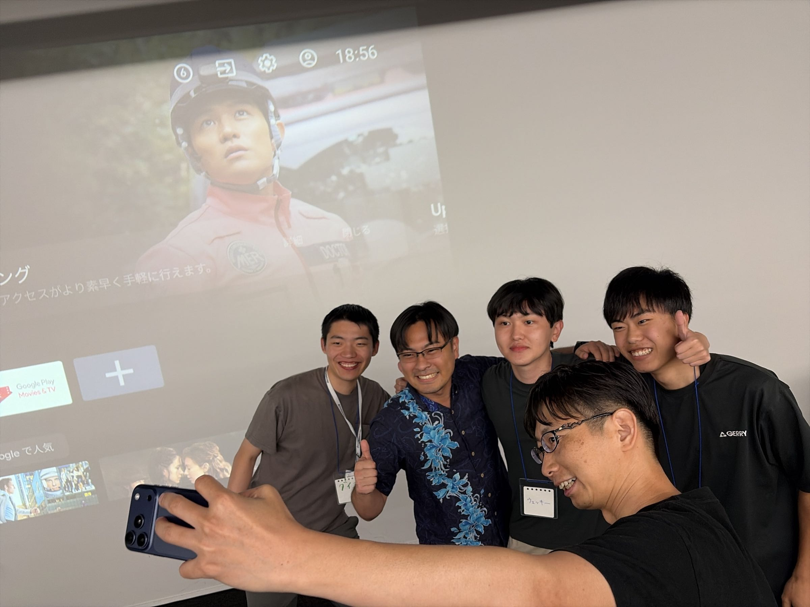
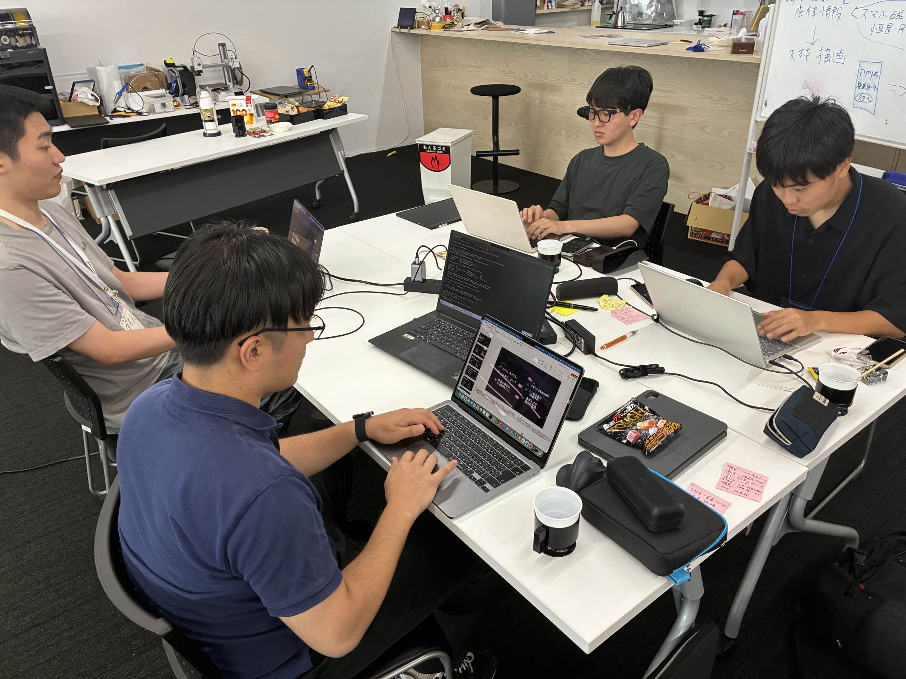
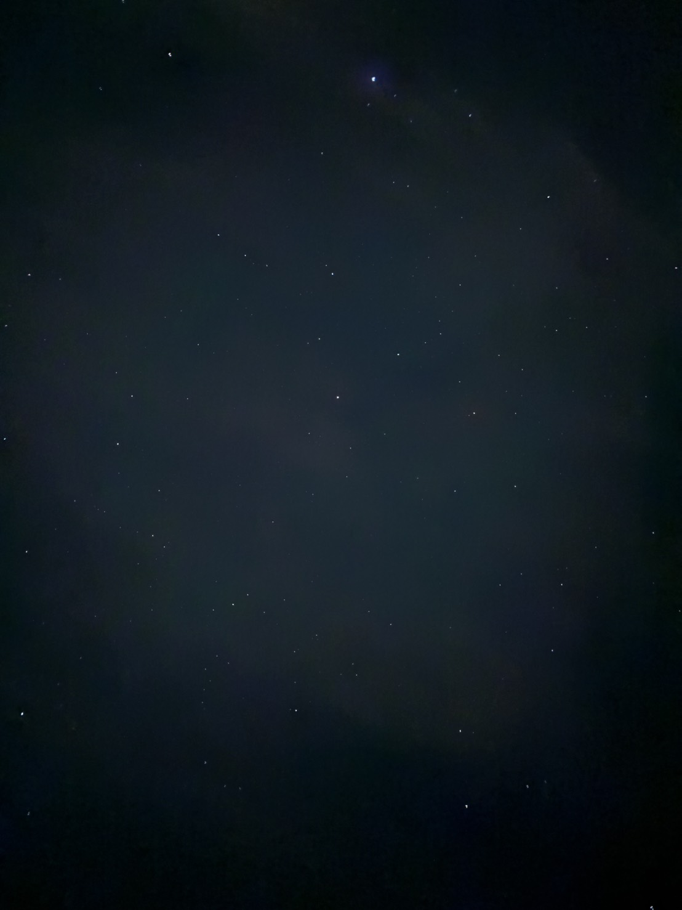

## はじめに

8/17から28までの間、jig.jpのサマーインターンに参加してきました。

福井の古民家に2週間泊まり込み、SABERAというスマートグラス向けのアプリをチームで開発する、というプログラムです。

今回は2週間の共同生活・チーム開発を経て学んだことを書きたいと思います。



## 参加のきっかけ

jig.jpという会社を知ったのは、サマーインターンの説明会が最初でした。

そこで聞いたのが、SABERAという国産では初（？）のスマートグラスを題材にしたインターンを今年から始める、という話。
しかも自分たちが1期生になるとのことでした。

スマホでもPCでもない新しいデバイスが立ち上がる時期に関われる機会は、そう多くありません。加えて、単純にスマートグラスを触ってみたいという興味もあり、応募を決めました。

## つくったもの

SABERAのインターンは、3人ずつ3チームに分かれてのチーム開発です。私たちのチームが開発したのは、**星導**（ほししるべ）というアプリでした。

SABERAをかけて空を見上げると、いま見ている星空に星座が重なって見える。ハンズフリーで星空を案内してくれるアプリです。



## 結果は……

最終日の成果報告会で、オーディエンス賞をいただきました。



副賞はClaude Code 1年分……のはずだったのですが、jig.jp創業者の福野泰介さんのご提案で、チームメンバー3人のうち1人がSABERAの実機をいただけることになりました。

まさか実機がもらえるとは思っていなかったので、これはかなりテンションが上がりました。とはいえ、もらえるのは3人のうち1人。最後はチームメンバー3人で、SABERA（約10万円相当）を賭けた一発じゃんけんで決めることに。

結果は、私の勝利です。いと氏、ネル、今度会ったときは交代で使いましょう。

もちろん実機をいただけたことも嬉しかったのですが、それ以上に、このメンバーで受賞できたことが誇らしかったです。

プレゼン資料の作成と数え切れないバグフィックス、そしてアイデア出しを担ってくれたいと氏。「こうすればもっと良くなるのでは」とUI・UXについて提案し続けてくれたネル。そして、私たちがアイデアを形にできるよう爆速でSDKを開発してくださったダイスさん。本当にありがとうございました。

## 「SABERAでしかできないこと」を考え続けた

開発期間のうち、思っていたよりずっと長い時間を、アイデア出しとSABERAの優位性についての議論に使いました。話に付き合ってくれた、いと氏・ネル・なにがし・めぷさんに感謝です。

SABERAの強みは、スマホを取り出さなくても情報が見えること、そしてAR HUDとしての体験にあります。ただ、「便利です」で止まってしまうと、正直それスマホでもいいよね、という話になってしまう。

では、**SABERAでしかできないことは何だろう**。ひたすらそれを考えていました。

最初に挙がっていたのは、SABERA上でClaude CodeやCodexのターミナルを動かすという案や、TODOリストを表示するという案でした。スマートグラス上でコーディングエージェントが動いたら、正直かなり熱い。ただ、競合にあたるEven G2などはすでにそれを実現していて、これはSABERAだからできることではないな、と思い直しました。

捨てた理由は、技術的に無理だからではありません。むしろ逆で、いまはAIを使えばたいていのものが作れてしまうので、**それはいつでも作れる**、つまりこの2週間でやる必要はない、と感じたからでした。判断の基準が「実装できるかどうか」から「ここでやる意味があるかどうか」に移った瞬間だったと思います。

方向が決まったきっかけは、チームメイトの「6軸IMUを使って何かやりたいよね」という一言でした。それを聞いた瞬間に自分の中からパッと出てきたのが、星座・星見のアプリです。頭の向きがそのまま入力になるデバイスなら、「空を見上げる」という動作そのものをインターフェースにできる。そもそも星空は、見上げた先にしかありません。

他のチームがSABERAの良さをまったく違う角度から捉えていたのは意外でした。「SABERAは他の人から画面を見られない」という評価軸もあり、確かになぁと思わされました。

## 中間報告で方向転換した話

チームメンバーのおかげで、開発開始からちょうど1週間でプロトタイプを完成させることができました。

そして迎えた中間報告。ここでCFOの方からいただいたアドバイスによって、チームの方向性が一転します。

いただいたのは、主に次の2点でした。

- 意外とビジネス向けの需要もある
- ターゲットの絞り込みが甘いのではないか

2つ目については、実は自分でも薄々感じていたところだったので、指摘されて「やっぱりか〜」となりました。この段階で言ってもらえてよかったです。

そこからシフトチェンジし、旅行会社向けに星空のガイドを作成する機能と、そのガイドを配布する仕組みを追加していきました。

そして結果的に一番うけたのは、なるべく通信をしない設計にしていたことだったようです。

星空を見る場所は、山間部やキャンプ場など、だいたい圏外なんですよね。そこで動かないアプリには意味がない、という前提で組んでいたことが、そのまま強みになりました。制約から入るのは、思っていた以上に大事なのだと思います。

## AI駆動開発をやってみた感想

今回はClaude CodeやCodexをがっつり使って開発しました。感じたことをいくつか書いておきます。

### まず動くもの（MVP）を作ると、アイデアが出てくる

MVPを一度形にしてしまうと、頭の中だけで考えていたときには見えなかった選択肢が急に見えてきます。これはかなり実感しました。

### 最初のアイデア出しは、まだ人間のほうが得意

技術構成を考えるときも、基礎知識がある人でないと判断できない場面が多くありました。コードを書くこと自体はもう完全にAIが上回っているからこそ、その周辺の知識が活きてくるのだと思います。



### 規模が大きくなると急に進みが遅くなる

序盤のスピードは本当に速いのですが、コードが増えてくると急に詰まりはじめます。そのため、ドキュメントの整備は最後まで欠かさないようにしました。

やってみて良かったのが、ドキュメントの先頭に読み順の番号を振る方法です。

```
10_〇〇.md   ← SDK関連
11_〇〇.md
20_〇〇.md   ← 計算関連
21_〇〇.md
index.md
```

こんな具合に、10番台はSDK関連、20番台は計算関連……と分類しておきます。これに `index.md` を足しておくと、AIが余計なコンテキストを消費せずに開発を進められました。おすすめです。

### 「それ本当に必要？」が生まれやすい

爆速で機能が作れてしまうぶん、勢いで実装した機能が後から「これいる？」になりがちです。機能をたくさん作るとやった気にはなれるのですが、それがかえってUXの悪さにつながってしまう。

### 結局、どこまでをAIに任せるか

2週間やってみて、自分なりの境目が少し見えてきました。

自分たちでやるべきなのは、最初の課題の整理と、チーム内での認識のすり合わせです。ここをAIに投げても、そもそも何を作りたいのかが曖昧なままでは、返ってくるものも曖昧になります。

そのうえで大事だったのが、コードの細部は書けなくてもいいから、**データベースがどう、APIがどう、SDKがどう、といった一段抽象度の高いレイヤーで会話できること**でした。その層でどれだけ具体的に話せるかが、そのまま成果物の質になっていた感覚があります。

コードを書かせるのは、プランが立ってから。この順番を逆にすると、たいてい後戻りが増えます。

## うまくいかなかったこと

### タスクの振り分けが甘かった

誰が何をやるのかを曖昧にしたまま進めてしまった場面がありました。これは素直に反省点です。

### 「一番伝えたいこと」がチーム内でズレていた

発表のとき、それぞれが少しずつ違う推しポイントを持ったまま本番を迎えてしまった感覚がありました。認識の不一致は、こわい。

### 発表が学会発表すぎた

最終発表は、LTとしてはあまり好ましくない形だったと思っています。完全に学会発表の作法でした。

よく言えば、Appendixをたくさん用意し、想定される質問に対する広さと深さは意識できていました。……ただ、LTはそういう場ではないんですよね。

次はもっと肩の力の抜けた、ヤドンくんのような話し方を目指したいです。あのゆるさ、どうやって出しているのでしょう。

## 古民家生活

はじめて会う人たちとの2週間の共同生活。新幹線の中では「どうなることやら」とずっと考えていました。しかも周りは高専生が多く、大学生の自分が話についていけるのかも不安でした。

でも、完全に杞憂でした。

みんな志が高く、真剣に向き合っている人ばかりで。強みの種類がこんなにあるのか、と驚かされました。

- 実装力が高い人
- 技術力がある人
- 言語化が得意な人
- AIとの壁打ちがうまい人
- アイデアやモチーフ決めが上手い人

自分は比較的、実装力が高い側だったと思うのですが、そのぶん言語化がまったくできていませんでした。

一番それを痛感したのは、自分の頭の中にあるアイデアをチームメイトに説明するときです。自分の中では構想が見えているのに、それをそのまま相手に渡すことができない。思ったことをすぐ口に出してしまうので、頭の中で構成を組み立ててから話す、というのができていませんでした。

理想を言えば、マークダウンで見出しを立てるように話せるようになりたい。「## いま話したいのはこれ」「### 理由は3つ」くらいの粒度で組み立ててから口を開ければ、伝わり方はかなり変わるはずです。ここは次までの宿題にします。

幸い、チームに言語化が得意な人がいてくれたおかげで、頭の中にあったアイデアはちゃんと形になりました。ありがとう……。

### 古民家が星導のデバッグに向きすぎる件

そして、古民家の周りがとにかく暗い。

これが星導のデバッグにこれ以上ないほど向いていました。外に出るとそこがテスト環境、という贅沢な状況です。ついでに、いい感じのデジタルデトックスにもなりました。



## これから

大学の授業でチーム開発をする機会はありましたが、見ず知らずの人たちと組むのはこれが初めてでした。

いろいろな価値観や強みを持った人がいると知れたことが、いちばん大きな収穫だったと思います。これからはハッカソンや勉強会にも積極的に出ていって、自分の強みを広げていけたらと考えています。

まずは、いただいたSABERAで何かを作るところから。

2週間、本当にありがとうございました！