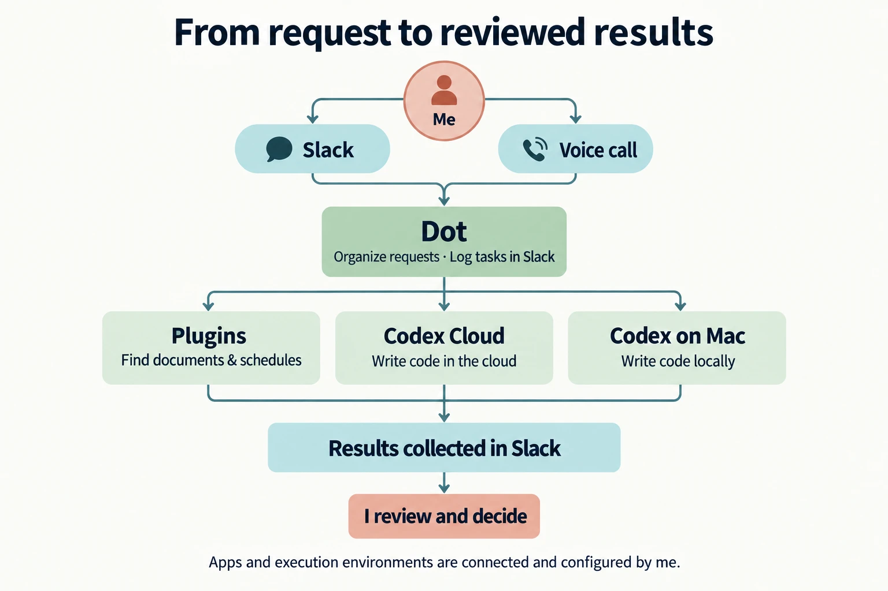
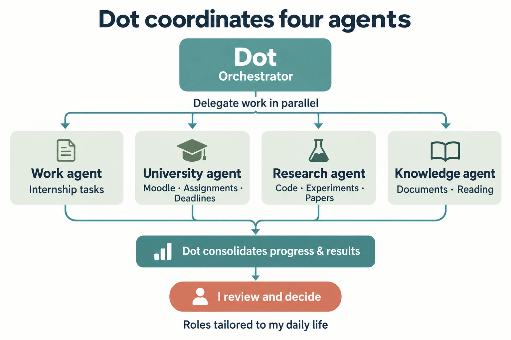

## Building a personal assistant

OpenAI [announced Dots on September 29, 2026](https://openai.com/index/introducing-dots/). Dots are always-on AI agents that can continue working between conversations. You can reach them through ChatGPT or Slack, or talk to them using ChatGPT's voice calling feature.

::youtube[OpenAI official introduction to Dots]{id="uXspbC2srEQ"}

I used OpenAI Dots to build a personal assistant for my everyday research, university assignments, and internship.

The basic workflow starts with a request in Slack or a voice conversation. My setup records that request as a task in Slack, then looks up materials through service APIs connected as ChatGPT plugins. When coding is needed, it can hand work to Codex in the cloud or to local Codex on my Mac. Voice requests are recorded in Slack too, so I can revisit both the request and its outcome later.

This post introduces how I fit Dots into my day and how the work flows. The architecture and implementation are covered on the [project page](/en/projects/kei-agent).

## Keeping work moving while I sleep or commute

The biggest benefit is being able to make progress while I am away from my computer.

For example, I can assign a research task before bed, let it work on code changes or experiments overnight, and review the results in the morning. I can then decide whether to use the results or run another experiment. When I sit down to work, I already have something to evaluate.

The same applies on the train. Even when I cannot open my laptop, I can send a request to my Dot from my phone and have Codex work on it in the cloud. Dot keeps coordinating the work, so I can review it and think about the next step when I get back to my desk.

Tasks assigned to local Codex still need my Mac to be awake, but cloud work can continue without my laptop being open. Some tasks also need clarification along the way. I answer those questions and review the completed work myself.

This diagram highlights requests, reviews, and decisions for work delegated to AI. It does not represent all the time I spend on my internship or research.

I spend less time waiting for a long stretch at my desk before starting something. I can send a request when I have a moment, then return to work that has already moved forward. That is a large part of the appeal for me.

## Using Dot as an orchestrator

I call my individual agent in Dots “Dot.” In my setup, Dot acts as an orchestrator: it receives requests, assigns work to the appropriate agent, and brings progress and results together.

Behind it, I have agents for work, university, research, and knowledge. Internship requests go to the work agent, assignment checks to the university agent, experiments and code changes to the research agent, and materials and reading to the knowledge agent. These are roles I chose for my own life, rather than built-in categories in Dots.

I use Dot for this role because it connects everyday conversations with the environments where work happens. Whether I ask through Slack or discuss something on a call, it can use that context to find materials and delegate the work. That reduces the need to open each agent or service separately for every request.

Looking at research and coursework in isolation also makes it harder to see the day as a whole. I have Dot bring information from the different agents together so I can understand what has progressed and which decisions need my attention next.

## Where I use it day to day

### Research: keeping a record of work and experiments

Research happens in workspaces organized by topic, with tasks such as writing code, running experiments, and finding relevant papers. Work logs and experiment results accumulate in a Notion research database.

Keeping a record of what was tried and what happened gives me something to revisit when planning the next experiment. For overnight work, I can read the logs in the morning and decide where to go next.

### University: gathering assignments and deadlines

The university agent imports assignments and deadlines from Moodle, the learning platform used at Waseda, and synchronizes them to Notion. This gives me a place to check newly posted assignments and approaching deadlines.

It reduces repeated visits to individual course pages and lets me plan the day with Dot using the information that has been collected.

### Internship: handing work to a dedicated agent

Internship requests go to the work agent. Its working environment stays separate from research and coursework, while Dot provides a shared way to assign tasks and check progress.

### Reading and reflection: organizing everyday information

On the reading side, Dot regularly finds, reads, and selects articles. It shares this work with the knowledge agent to help me keep up with topics I care about.

It can also retrieve my schedule from Outlook for morning planning and an evening review. Seeing appointments alongside coursework and research progress makes it easier to decide what deserves my time next.

## Reviewing results and deciding what comes next

What I wanted was a personal assistant I could give everyday tasks to, and that could keep making progress while I was away.

Assign work before bed and make decisions in the morning. Send a request while commuting and think about the next step back at my desk. The possibility of working to that rhythm is what interests me about Dots.

To try the setup, see the [Kei Agent repository](https://github.com/97kuek/kei-agent). The [project page](/en/projects/kei-agent) covers the implementation, and [OpenAI's official guide](https://learn.chatgpt.com/docs/dots/getting-started) explains how to get started with Dots itself.
