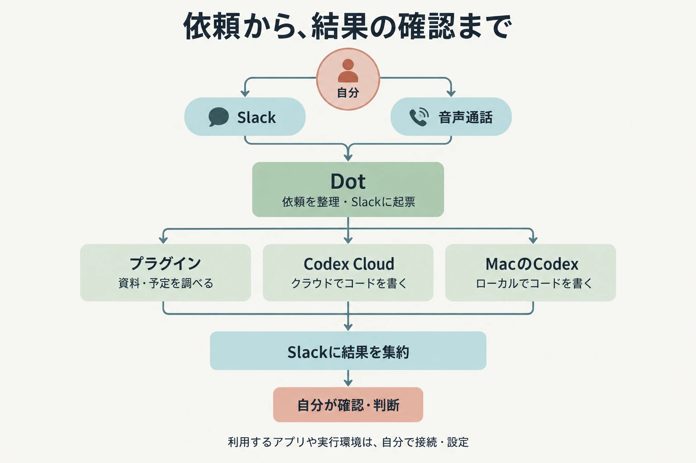
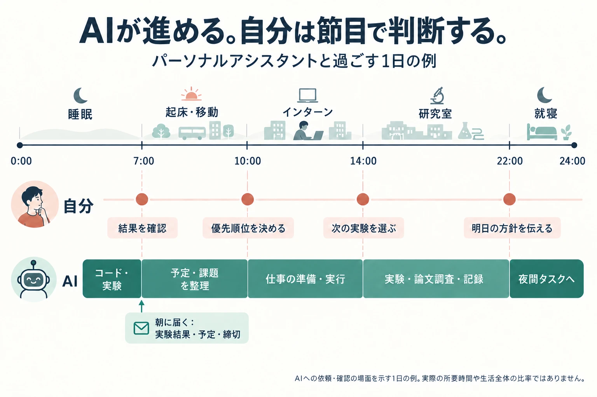
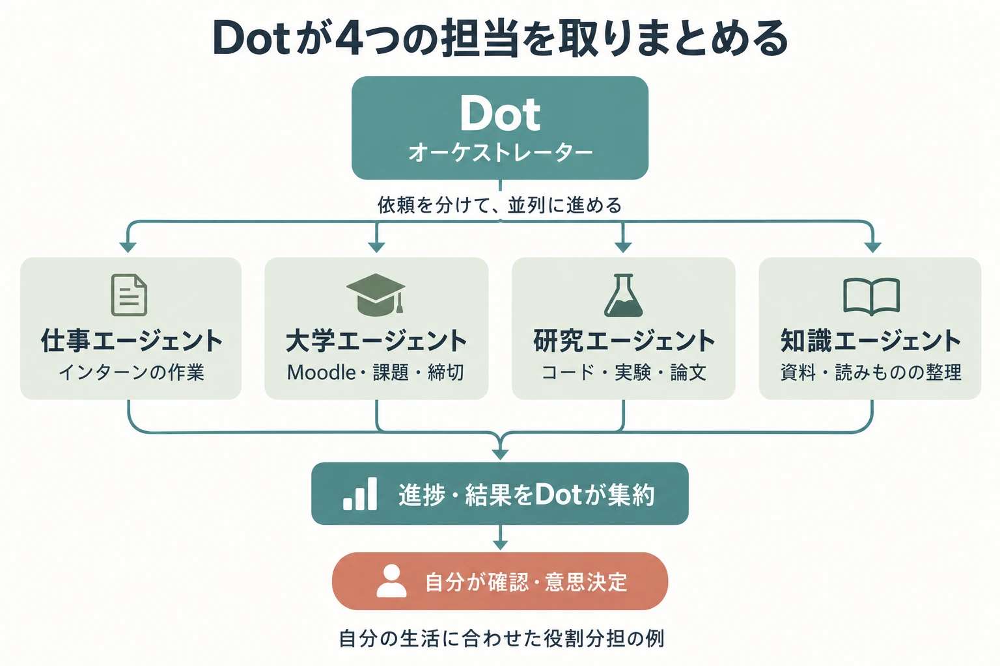

## パーソナルアシスタントを作る

2026年9月29日、OpenAIが[Dotsを発表しました](https://openai.com/index/introducing-dots/)。Dotsは、会話の合間にも作業を進められる常駐型のAIエージェントです。ChatGPTやSlackから話しかけたり、ChatGPTの通話機能で音声対話したりできます。

::youtube[OpenAI公式：Dotsの紹介]{id="uXspbC2srEQ"}

このOpenAI Dotsを使って、日々の研究や大学の課題、インターンを扱うパーソナルアシスタントを作りました。

大まかな流れは、Slackや音声で用事を頼むと、その依頼をSlackにタスクとして起票するというものです。そこから、ChatGPTに接続したプラグイン経由で各サービスのAPIを使って資料を調べたり、必要に応じてクラウドのCodexや自分のMacで動くローカルのCodexにコードを書いてもらったりします。音声で頼んだこともSlackに残るので、あとから依頼や結果を辿れます。

この記事では、Dotsを日常にどう組み込み、どんな流れで使っているかを紹介します。技術構成や実装については、[プロジェクトページ](/projects/kei-agent)にまとめています。

## 寝ている間や移動中にも、作業を進められる

パーソナルアシスタントを作って嬉しいのは、自分がパソコンに向かっていない時間にも作業を進められることです。

たとえば、寝る前に研究のタスクを頼んでおく。夜間にコードの変更や実験を進めてもらい、朝起きたらその結果を確認する。自分はそこから、結果を採用するか、追加で何を試すかを判断できます。朝に作業を始めるとき、検討するための材料がすでに揃っている、という流れです。

電車で移動しているときも同じです。パソコンを開けなくても、スマホからDotに依頼して、クラウドのCodexで作業を進めてもらえます。Dotが継続して作業を取りまとめてくれるので、机に戻ってから結果を見て続きを考えられます。

ローカルのCodexに任せる処理にはMacが起動している必要がありますが、クラウドで進められる作業なら、自分のパソコンを開いておく必要はありません。もちろん、途中で確認が必要になることもあります。そのときはDotからの質問に答え、完成したものは自分で確認します。

この図では、AIに任せた作業への依頼・確認・意思決定を抜き出しています。人がインターンや研究に取り組む時間全体を表したものではありません。

作業のためにまとまった時間が取れるまで待つ場面が減る。空いた時間に依頼しておけば、次に向き合うときには一歩進んでいる。この感覚が大きな魅力だと思っています。

## Dotをオーケストレーターとして使う

Dotsで作った自分のエージェントを、ここでは「Dot」と呼びます。僕の構成では、このDotをオーケストレーター、つまり依頼を受けて各担当に作業を振り分け、進捗や結果を取りまとめる役として使っています。

Dotの先には、仕事・大学・研究・知識を扱う各エージェントを用意しています。インターンの用事は仕事エージェント、課題の確認は大学エージェント、実験やコードの変更は研究エージェント、資料や読みものの整理は知識エージェント、という分担です。これはDotsの標準の分類ではなく、自分の生活に合わせて作った役割分担です。

Dotをこの役に置く理由は、普段の会話と、実際に作業する環境をつなげられるからです。Slackで頼んでも、通話で相談しても、その内容をもとに必要な資料を調べ、担当に仕事を渡せます。自分が依頼のたびに個々のエージェントやサービスを開き直す手間を減らせます。

また、研究だけ、大学だけを見ていると、その日の予定全体を把握しにくくなります。Dotには各担当からの情報をまとめてもらい、今どこまで進んでいて、次に自分が何を判断すればよいかを確認できるようにしています。

## 日常のどこで使っているか

### 研究：作業と実験の記録を蓄積する

研究では、テーマごとの作業場でコードを書いたり、実験を回したり、関連する論文を探したりします。作業ログや実験結果はNotionの研究データベースに蓄積していきます。

結果だけでなく、何を試してどうなったかを残しておくと、次の実験を考えるときに振り返れます。夜間に任せた作業も、朝にログを見ながら次の方針を決められます。

### 大学：新しい課題や締切をまとめる

大学エージェントでは、早稲田で使っている学習支援システムのMoodleから課題や締切を取り込み、Notionに同期します。新しく出た課題や、提出期限が近いものをまとめて確認するためです。

授業ごとのページを何度も見に行く手間を減らし、取り込んだ情報をもとにDotとその日の予定を考えられるようにしています。

### インターン：仕事の担当に作業を渡す

インターンに関する用事は、仕事エージェントに分担させます。研究や大学の課題とは作業する環境を分けながら、依頼や進捗の確認はDotを通じて行う形です。

### 読みものと振り返り：日々の情報を整理する

読みものについては、Dot側で定期的に記事を探し、読んで選んでもらいます。知識エージェントと分担しながら、気になる情報を追うために使っています。

また、Outlookから予定を取得し、朝にその日の動きを確認したり、夜に一日を振り返ったりすることもできます。課題や研究の進捗と予定を一緒に見られると、次に何へ時間を使うかを考えやすくなります。

## 自分は結果を見て、次のことを考える

今回作りたかったのは、日々の用事を頼めて、自分が離れている間にも作業を進めてくれるパーソナルアシスタントです。

寝る前に任せ、朝に判断する。移動中に頼み、机に戻ったら続きを考える。作業の進め方をこのリズムに変えられるところに、Dotsの面白さを感じています。

導入や設定を試したい方は、[Kei Agentのリポジトリ](https://github.com/97kuek/kei-agent)を参考にしてください。実装の仕組みは[プロジェクトページ](/projects/kei-agent)、Dots自体の始め方は[OpenAIの公式ガイド](https://learn.chatgpt.com/docs/dots/getting-started)にまとめられています。
