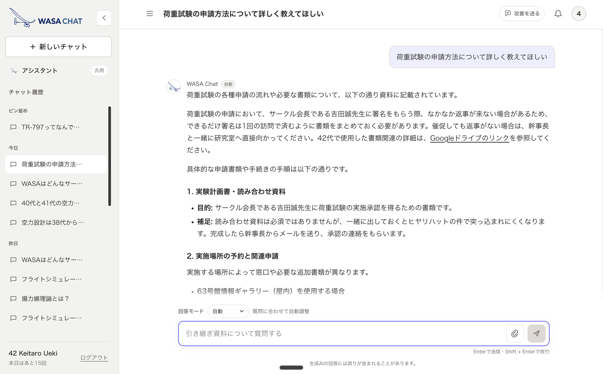

## Overview

I built a RAG chatbot for the handover at WASA, the human-powered aircraft project I was part of at
Waseda University.

WASA keeps the build and design knowledge of decades on a handover wiki, and every year of members
adds another layer to it, until it is hard to read at all.

I wrote WASA Chat after I had left the project, but the question behind it came from my own year on
the executive team, when the handover material was enormous and difficult to make sense of:

“Is there a way for members to reach what they want to know quickly?”

That is what I set out to answer, and my work as an AI engineer pointed at a chatbot members could
ask in their own words.

The index currently draws on the handover wiki, the official site, and the flight simulator guide
(FEE).

## Features

- Citation-backed chat, including questions with attached images
- A shared assistant and up to 30 conversations of history
- An admin view for usage, estimated API budget, document updates, and audit logs
- Admin rights granted to individual wiki accounts instead of one shared account

## Architecture

The interface runs on Cloudflare Pages, while authentication, retrieval, answer generation, and the
admin API run on Cloud Run. The index — which contains wiki text — lives in a private Cloud Storage
bucket, and history and usage data go to Firestore.

Rather than fetching from the wiki on every question, the system searches an index built ahead of
time. That keeps answers fast and keeps load and cost on external services low. Admins can check for
changed documents from the dashboard, but rebuilding the index and shipping it to production stays a
deliberate, human-reviewed step.

## Status

The project is in production and in an accuracy-improvement phase. Because it will be handed over to
future members, the reasoning behind each design decision and the operational runbooks are kept as
documentation in the repository.

The code is MIT licensed; the wiki content and retrieved data belong to the WASA project and are not
covered by that license.
